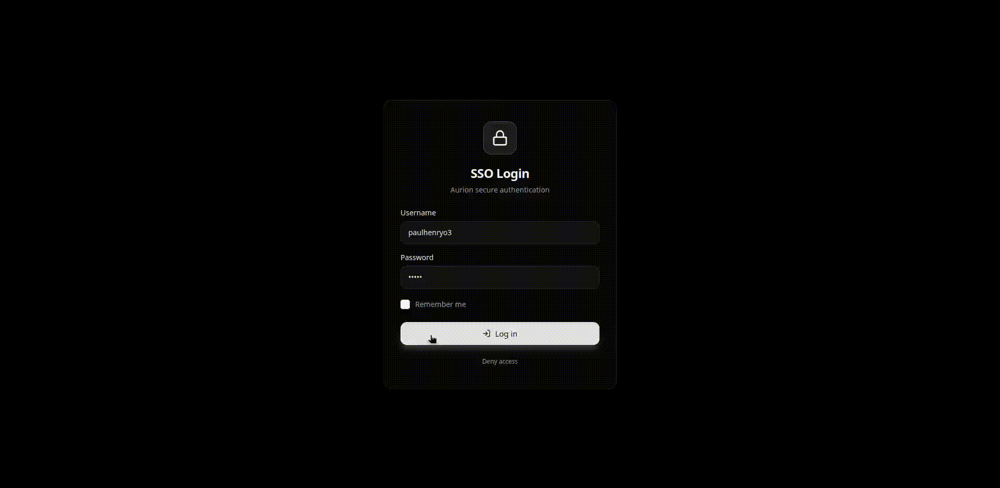
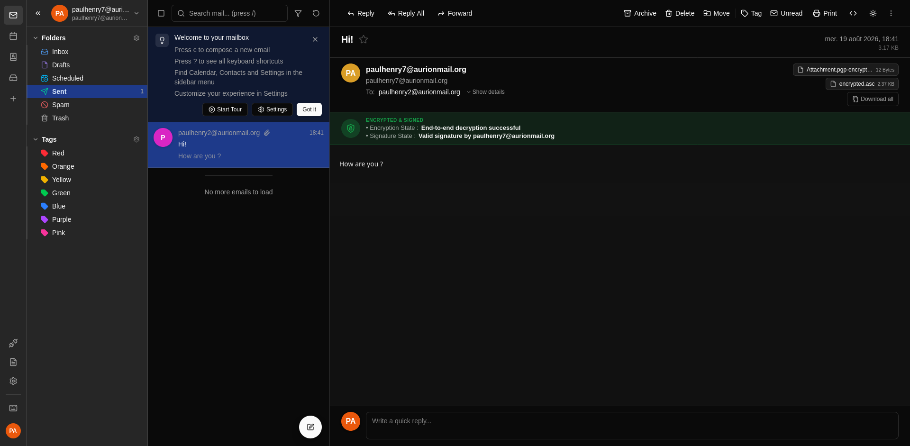
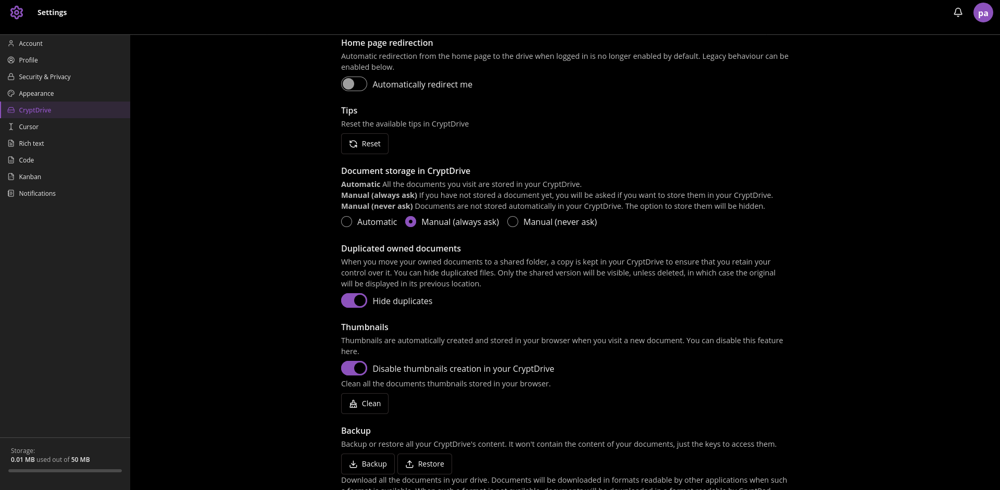

<picture>
  <source media="(prefers-color-scheme: light)" srcset="https://raw.githubusercontent.com/AurionMail/.github/main/assets/logo_dark.png" />
  <source media="(prefers-color-scheme: dark)" srcset="https://raw.githubusercontent.com/AurionMail/.github/main/assets/logo_light.png" />
  
</picture>

 
 

The AurionMail Suite is a free and open-source end-to-end encrypted productivity suite.

**TL;DR:** AurionMail Suite delivers a Proton-like user experience by combining proven technologies such as CryptPad, Bulwark Webmail, Stalwart Mail Server, Ory Hydra, and OpenPGP.

## The Problem
CryptPad is a powerful collaborative suite, but email falls outside its core scope. Consequently, using encrypted documents alongside encrypted emails traditionally requires managing two separate accounts and passwords.

AurionMail acts as the orchestrator linking CryptPad and a JMAP-based email service into a single, unified workflow.

## What does this mean for the user?
Users only need to remember **one single password** to encrypt and decrypt both their emails and CryptPad documents. You enter it once per session to access CryptPad, the webmail, or both.

Additionally, we refreshed CryptPad's UI to provide a modern, cohesive look and feel across the suite.

## Video Demo
Demonstrate the Single login to access Mail encryption and Cryptpad documents + the new Cryptpad UI

## Why AurionMail Suite?

Existing privacy solutions usually force a compromise between **user experience**, **self-hosting control**, and **open standards**. 

Commercial suites offer a seamless single-password workflow, but their backends remain closed-source. On the other hand, self-hosted alternatives often fragment the user experience, requiring users to manage separate accounts and passwords for email and document collaboration.

AurionMail Suite bridges this gap by delivering the smooth Zero-Knowledge experience of commercial platforms on top of a 100% open-source, standards-compliant, self-hosted stack.

| Feature | Proton Suite | Nextcloud + Mail | Standard CryptPad | **AurionMail Suite** |
| --- | --- | --- | --- | --- |
| **100% Open Source & Self-Hosted** | ❌ *(Proprietary backend)* | 🟢 Yes | 🟢 Yes | 🟢 **Yes** |
| **E2EE Email & Documents** | 🟢 Yes | 🟡 *(Complex / Plugin-based)* | ❌ *(No built-in email)* | 🟢 **Yes** |
| **Unified Identity & Encryption (1 Password)** | 🟢 Yes | ❌ *(Fragmented SSO / Manual PGP)* | ❌ *(Docs-only account scope)* | 🟢 **Yes** |
| **Open Standards (OpenPGP, JMAP)** | 🟡 *(OpenPGP supported, limited key discovery)* | 🟢 Yes | ❌ *(N/A for email)* | 🟢 **Yes** |

#### vs. Standard CryptPad
CryptPad excels at secure document collaboration but lacks email. AurionMail extends CryptPad with a fully integrated, E2EE JMAP email client—sharing the same single Zero-Knowledge password so users don't have to manage two isolated systems.

#### vs. Nextcloud + Mail
Nextcloud Mail is a standard IMAP client that relies on browser extensions (like Mailvelope) and manual PGP key management for end-to-end encryption. AurionMail delivers seamless, out-of-the-box Zero-Knowledge encryption without complex user workflows.

#### vs. Proton Suite
Proton offers a smooth single-password experience, but its backend is closed-source and locks you into their cloud. AurionMail gives you that exact same seamless user experience on a 100% open-source, self-hosted stack built on open standards.

## Features
### Currently Supported
- **Single Password Encryption:** Authenticate and encrypt all user data with one master password.
- **Single Logout:** Logging out from either Webmail or CryptPad automatically logs you out across the entire session/device.
- **Global Logout** ("Logout from all devices").
- **Password change** Change your master password without loosing your data.
- **Key Synchronization:** Seamless key syncing across authorized user devices.
- **Core Integrations:** Full feature sets inherited from underlying services ([CryptPad](https://docs.cryptpad.org/),  [Bulwark Webmail](https://github.com/bulwarkmail/webmail/) and the [PGP E2E Plugin for Bulwark](https://github.com/paulhenry46/pgp-plugin)).
- **Account install** : You can create users in LDAP with your workflow and give them a temporary password. Users then visit sso.domain/init to create their master password and activate their account.
- **Web Key Server** : Imported/Generated key in the PGP Plugin are automatically discoverable with Web Key Directory.

### Roadmap / Planned Features
- **Emergency Account Hold:** A secure URL generated at account creation that disables the account if accessed (protecting data if a master password is compromised).
- **Emergency Account Destruction:** A secure URL that permanently destroys the account and its associated keys if visited.

## Screenshots

<table>
<tr>
<td width="50%"></td>
<td width="50%"></td>
</tr>
<tr>
<td><b>Login</b> – Login page.</td>
<td><b>Logout</b> – Logout page.</td>
</tr>
<tr>
<td></td>
<td></td>
</tr>
<tr>
<td><b>Bulwark's Aurion Plugin</b> – Manage keys, change password, with the Aurion Plugin.</td>
<td><b>Email Encryption</b> – Send encryptped emails to your contacts.</td>
</tr>
<tr>
<td></td>
<td></td>
</tr>
<tr>
<td><b>Cryptpad Drive</b> – Cryptpad is integrated with a refreshed and modern UI</td>
<td><b>Cryptpad Settings</b> – You can still edit your cryptpad settings.</td>
</tr>
</table>

## Architecture Overview
Here is how the components fit together. Items highlighted in **bold** are built by the Aurion team:

- LDAP: User management (Identity Source of Truth).
- Ory Hydra: SSO OAuth2/OIDC backend handling authorization flows.
- **SSO Web App:** Frontend for authentication and Zero-Knowledge key derivation.
- Stalwart Server: High-performance JMAP mail server backend.
- Bulwark Webmail: Webmail frontend interface.
- **Bulwark PGP Plugin:** Extension enabling end-to-end OpenPGP mail encryption.
- **Core-API:** Central server managing key sync, session state, and inter-app communication.
- **Bridges:** Lightweight bridge scripts handling secure secret sharing during login/logout routines.
- **CryptPad (Customized):** Integrated with the SSO plugin and custom styling for a unified UI.

AurionMail is a distributed suite. However, you can use [Orchestra](https://github.com/AurionMail/orchestra) to get a single binary covering
- Hydra
- SSO
- Bulwark
- Core API
- Bridges
- Cryptpad Customized

See [Installation Guide](./install.md) for more details.
## Repositories & Components
Explore the individual sub-modules of the project:
- [SSO App](https://github.com/aurionMail/sso)
- [Bridges](https://github.com/AurionMail/bridges/)
- [PGP Plugin](https://github.com/AurionMail/bulwark-pgp-plugin)
- [Core API](https://github.com/AurionMail/core-api/)
- [CryptPad Customized](https://github.com/AurionMail/cryptpad_customized/)
- [Orchestra](https://github.com/AurionMail/orchestra)

## Getting Started
Are you a system administrator looking to test AurionMail? Check out the [Installation Guide](./install.md).