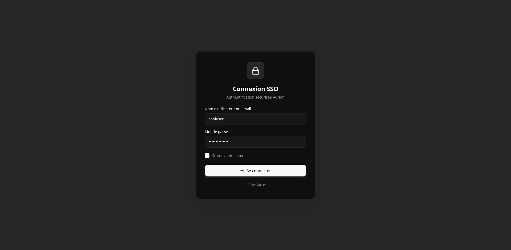
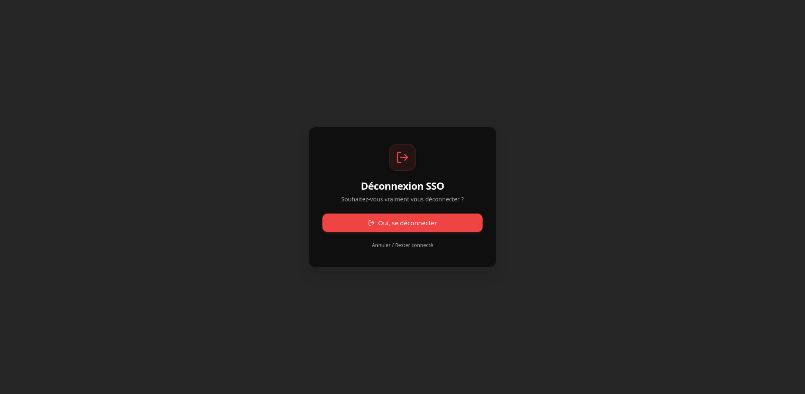
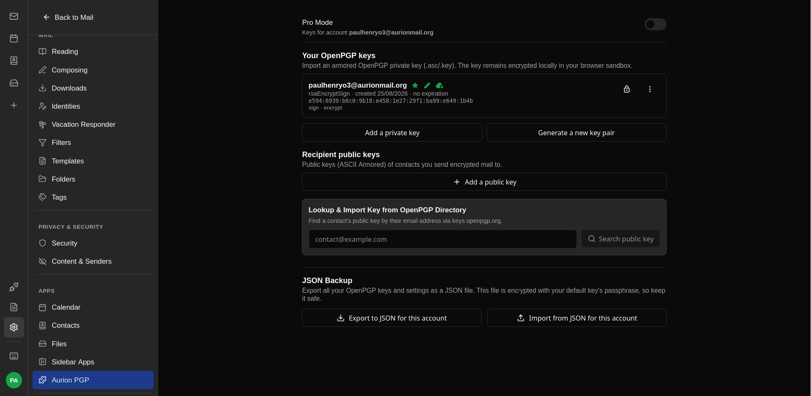
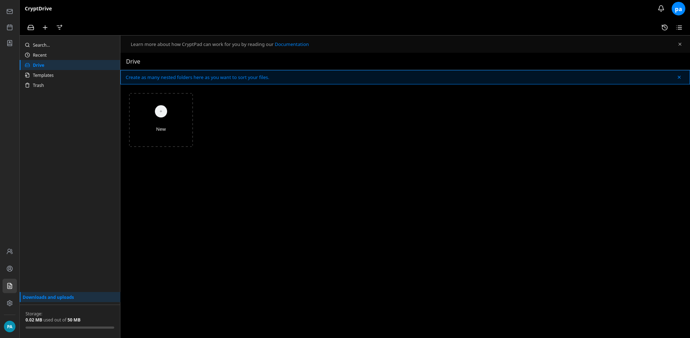

# AurionMail Suite
The AurionMail Suite is a free and open-source end-to-end encrypted productivity suite.

**TL;DR:** AurionMail Suite delivers a Proton-like user experience by combining proven technologies such as CryptPad, Bulwark Webmail, Stalwart Mail Server, Ory Hydra, and OpenPGP.

## The Problem
CryptPad is a powerful collaborative suite, but email falls outside its core scope. Consequently, using encrypted documents alongside encrypted emails traditionally requires managing two separate accounts and passwords.

AurionMail acts as the orchestrator linking CryptPad and a JMAP-based email service into a single, unified workflow.

## What does this mean for the user?
Users only need to remember **one single password** to encrypt and decrypt both their emails and CryptPad documents. You enter it once per session to access CryptPad, the webmail, or both.

Additionally, we refreshed CryptPad's UI to provide a modern, cohesive look and feel across the suite.
## Why AurionMail Suite?

Existing privacy solutions usually force a compromise between **user experience**, **self-hosting control**, and **open standards**. 

Commercial suites offer a seamless single-password workflow, but their backends remain closed-source. On the other hand, self-hosted alternatives often fragment the user experience, requiring users to manage separate accounts and passwords for email and document collaboration.

AurionMail Suite bridges this gap by delivering the smooth Zero-Knowledge experience of commercial platforms on top of a 100% open-source, standards-compliant, self-hosted stack.

| Feature | Proton Suite | Nextcloud + Mail | Standard CryptPad | **AurionMail Suite** |
| :--- | :---: | :---: | :---: | :---: |
| **100% Open Source & Self-Hosted** | ❌ *(Proprietary backend)* | 🟢 Yes | 🟢 Yes | 🟢 **Yes** |
| **E2EE Email & Documents** | 🟢 Yes | 🟡 *(Partial)* | ❌ *(Docs only)* | 🟢 **Yes** |
| **Single Zero-Knowledge Password** | 🟢 Yes | ❌ *(Separate passwords)* | ❌ *(No mail)* | 🟢 **Yes** |
| **Open Standards (OpenPGP, JMAP)** | ❌ *(Proprietary stack)* | 🟢 Yes | 🟢 Yes | 🟢 **Yes** |

### Key Advantages
- **Proton-like UX, Self-Hosted Freedom:** Enjoy an all-in-one productivity workflow while keeping complete control over your server and data.
- **Zero-Friction Encryption:** One master password handles client-side authentication and encryption across both webmail and CryptPad without prompting for extra passphrases.
- **No Vendor Lock-in:** Built entirely on established standards like **OpenPGP**, **JMAP**, and **OAuth2/OIDC**, ensuring your data remains fully portable.

## Features
### Currently Supported
- **Single Password Encryption:** Authenticate and encrypt all user data with one master password.
- **Single Logout:** Logging out from either Webmail or CryptPad automatically logs you out across the entire session/device.
- **Key Synchronization:** Seamless key syncing across authorized user devices.
- **Core Integrations:** Full feature sets inherited from underlying services ([CryptPad](https://docs.cryptpad.org/) and [Bulwark Webmail](https://github.com/bulwarkmail/webmail/)).

### Roadmap / Planned Features
- Password change mechanism.
- Global Logout ("Logout from all devices").
- **Emergency Account Hold:** A secure URL generated at account creation that disables the account if accessed (protecting data if a master password is compromised).
- **Emergency Account Destruction:** A secure URL that permanently destroys the account and its associated keys if visited.

## Screenshots

## Architecture Overview
Here is how the components fit together. Items highlighted in **bold** are built by the Aurion team:

- LDAP: User management (Identity Source of Truth).
- Ory Hydra: SSO OAuth2/OIDC backend handling authorization flows.
- **SSO Web App:** Frontend for authentication and Zero-Knowledge key derivation.
- Stalwart Server: High-performance JMAP mail server backend.
- Bulwark Webmail: Webmail frontend interface.
- **Bulwark PGP Plugin:** Extension enabling end-to-end OpenPGP mail encryption.
- **Core-API:** Central server managing key sync, session state, and inter-app communication.
- **Bridges:** Lightweight bridge scripts handling secure secret sharing during login/logout routines.
- **CryptPad (Customized):** Integrated with an SSO plugin and custom styling for a unified UI.

*Note: AurionMail is a distributed suite and does not ship as a monolithic single binary.*

## Repositories & Components
Explore the individual sub-modules of the project:
- [SSO App](https://github.com/aurionMail/sso)
- [Bridges](https://github.com/AurionMail/bridges/)
- [PGP Plugin](https://github.com/AurionMail/bulwark-pgp-plugin)
- [Core API](https://github.com/AurionMail/core-api/)
- [CryptPad Customized](https://github.com/AurionMail/cryptpad_customized/)

## Getting Started
Are you a system administrator looking to test AurionMail? Check out the [Installation Guide](./install.md).